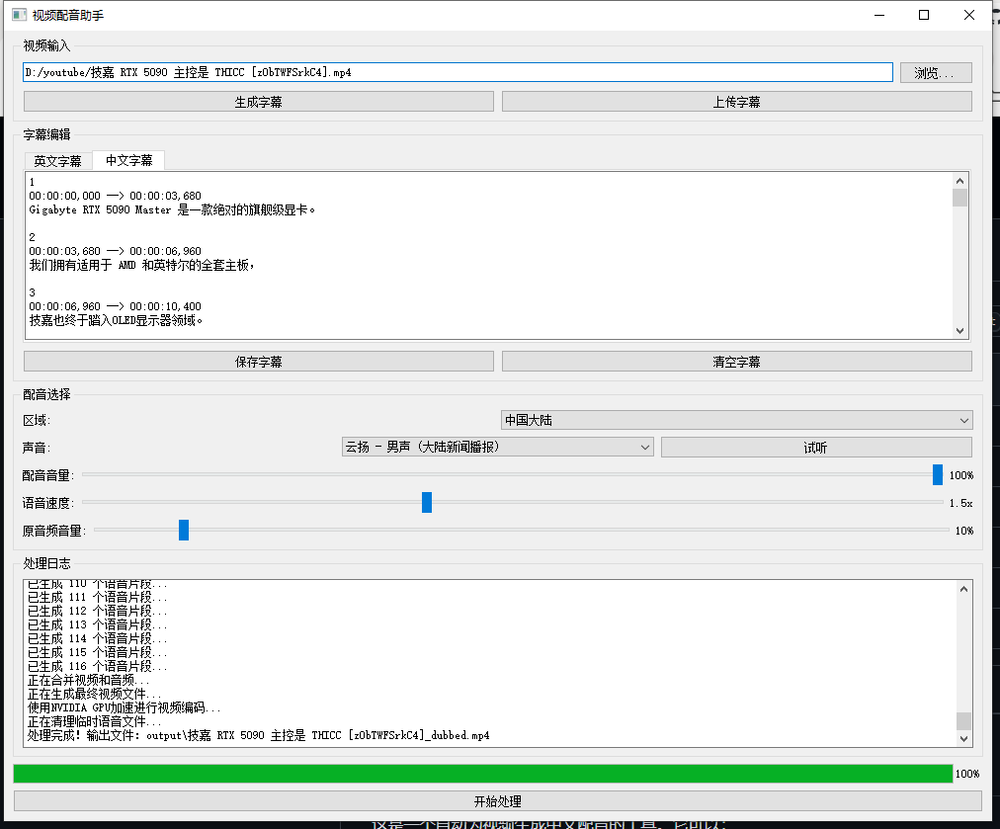

# 视频配音助手 (Video Dubbing Assistant)

这是一个自动为视频生成中文配音的工具。它可以：
1. 自动识别视频中的英文语音
2. 将英文翻译成中文
3. 使用微软Edge TTS生成自然的中文语音
4. 自动将配音合成到原视频中
5. 支持字幕编辑和上传

## 下载

访问 [Releases](https://github.com/yourusername/Dubbing-python/releases) 页面下载最新版本。

### 便携版
下载 `VideodubbingAssistant-portable.zip`，解压后直接运行 `VideodubbingAssistant.exe`

### 安装版
下载 `VideodubbingAssistant-setup.exe` 安装后运行

## 系统要求

1. Windows 10或更高版本
2. FFmpeg（便携版已内置，安装版会自动配置）
3. NVIDIA GPU（可选，用于加速处理）

## 开发环境配置

如果你想参与开发，需要：

1. Python 3.8或更高版本
2. Git

### 安装步骤

1. 克隆仓库：
```bash
git clone https://github.com/yourusername/Dubbing-python.git
cd Dubbing-python
```

2. 创建虚拟环境：
```bash
python -m venv venv
venv\Scripts\activate
```

3. 安装依赖：
```bash
pip install -r requirements.txt
```

4. 运行程序：
```bash
python gui.py
```

## 使用方法

运行以下命令启动图形界面：
```bash
python gui.py
```

在图形界面中：
1. 点击"浏览"选择本地视频文件
2. 点击"生成字幕"自动生成字幕，或点击"上传字幕"使用已有字幕
3. 在字幕编辑区域查看和编辑字幕
4. 选择配音声音（支持中国大陆、香港、台湾的多种声音）
5. 调整配音参数：
   - 配音音量
   - 原音频音量
   - 语音速度
6. 点击"开始处理"按钮
7. 等待处理完成，处理进度可在日志区域查看

## 可用的配音声音

### 中国大陆
- 晓伊 - 女声 (大陆标准普通话)
- 云希 - 男声 (大陆标准普通话)
- 云健 - 男声 (大陆标准普通话)
- 云扬 - 男声 (大陆新闻播报)
- 晓辰 - 女声 (大陆标准普通话)
- 晓涵 - 女声 (大陆标准普通话)
- 晓梦 - 女声 (大陆标准普通话)
- 晓墨 - 女声 (大陆标准普通话)
- 晓萱 - 女声 (大陆标准普通话)
- 晓颜 - 女声 (大陆标准普通话)
- 晓悠 - 女声 (大陆标准普通话)

### 中国香港
- 晓薇 - 女声 (香港粤语)
- 晓曼 - 女声 (香港粤语)
- 云龙 - 男声 (香港粤语)

### 中国台湾
- 晓臻 - 女声 (台湾国语)
- 云哲 - 男声 (台湾国语)
- 晓雨 - 女声 (台湾国语)

## 输出文件

程序会在以下目录生成相关文件：
- `subtitles/`: 生成的字幕文件
- `audio/`: 生成的配音文件（处理完成后会自动清理）
- `output/`: 最终生成的配音视频

## 注意事项

1. 确保系统已正确安装FFmpeg并添加到环境变量
2. 首次运行时会下载Whisper模型，需要稳定的网络连接
3. 如果有NVIDIA GPU，程序会自动使用GPU加速处理
4. 生成的视频文件会保存在output目录下，格式为`原文件名_dubbed.mp4`

## 技术栈

- PyQt5: 图形界面
- Whisper: 语音识别
- Edge TTS: 语音合成
- MoviePy: 视频处理
- PyTorch: 深度学习框架

以上由"Cursor"生成

## 构建

使用 PyInstaller 构建可执行文件：

```bash
pip install pyinstaller
pyinstaller VideodubbingAssistant.spec
```

## 自动发布

本项目使用 GitHub Actions 自动构建和发布：
- 每次推送 tag 时自动构建
- 自动创建 Release 并上传构建文件
- 自动更新版本号

## 贡献代码

1. Fork 本仓库
2. 创建特性分支 (`git checkout -b feature/AmazingFeature`)
3. 提交改动 (`git commit -m 'Add some AmazingFeature'`)
4. 推送到分支 (`git push origin feature/AmazingFeature`)
5. 提交 Pull Request

## 开源协议

本项目采用 MIT 协议 - 详见 [LICENSE](LICENSE) 文件

以上由"Cursor"生成